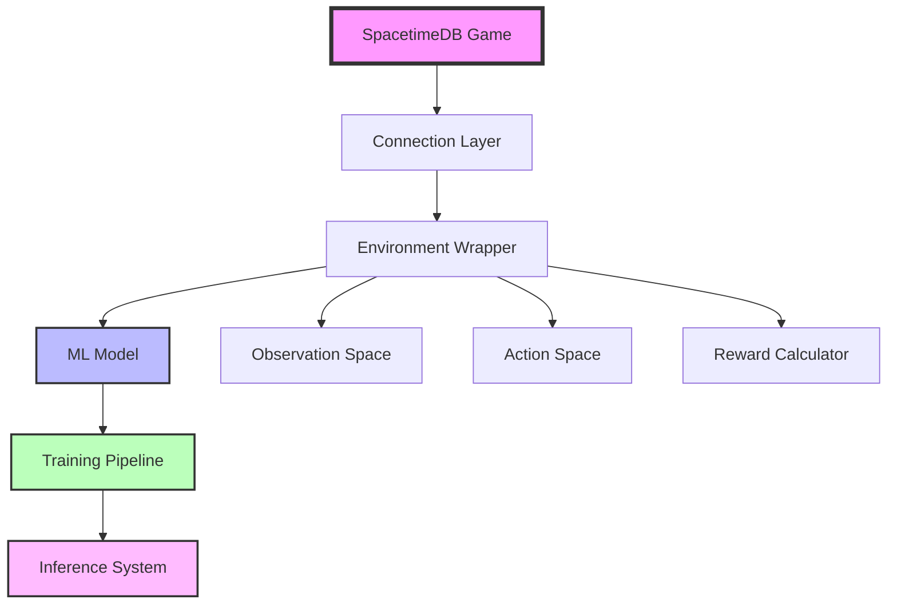

# SpacetimeDB Machine Learning Integration Guide

A comprehensive guide for adding ML agents to your SpacetimeDB project, based on the Blackholio Agent framework.

## Table of Contents

1. [Introduction](#introduction)
2. [Framework Overview](#framework-overview)
3. [Quick Start: From `spacetime init` to ML Agent](#quick-start-from-spacetime-init-to-ml-agent)
4. [Understanding Your Game for ML](#understanding-your-game-for-ml)
5. [Building Your Environment Wrapper](#building-your-environment-wrapper)
6. [Adapting Model Architecture](#adapting-model-architecture)
7. [Game Type Examples](#game-type-examples)
8. [Implementation Templates](#implementation-templates)
9. [Testing and Validation](#testing-and-validation)
10. [Deployment Strategies](#deployment-strategies)
11. [Advanced Topics](#advanced-topics)

## Introduction

This guide shows you how to transform any SpacetimeDB game into a machine learning environment using the patterns established in the Blackholio Agent project. Whether you've just run `spacetime init` or have an existing game, this guide will help you:

- **Understand** how SpacetimeDB concepts map to reinforcement learning
- **Build** a Gym-like environment wrapper for your game
- **Train** intelligent agents to play your game
- **Deploy** agents alongside human players

### Prerequisites

- Basic SpacetimeDB knowledge
- Python programming experience
- Understanding of your game's rules and objectives
- Familiarity with machine learning concepts (helpful but not required)

## Framework Overview

The Blackholio Agent framework provides a template for creating ML agents for any SpacetimeDB game. It consists of four main components:



### Key Components

1. **Connection Layer**: Manages SpacetimeDB connections and real-time data flow
2. **Environment Wrapper**: Converts game state to ML observations and actions to game commands
3. **ML Model**: Neural network that learns game strategies
4. **Training Pipeline**: System for improving the model through gameplay
5. **Inference System**: Production system for running trained agents

## Quick Start: From `spacetime init` to ML Agent

### Step 1: Set Up Your SpacetimeDB Project

Start with a basic SpacetimeDB project:

```bash
spacetime init my-ml-game --lang rust
cd my-ml-game
```

Ensure your game has:
- **Tables** for game state (players, entities, world state)
- **Reducers** for player actions
- **Subscriptions** for real-time updates

### Step 2: Install ML Framework

Clone the Blackholio Agent framework:

```bash
git clone <blackholio-agent-repo>
cd blackholio-agent
pip install -e .
```

### Step 3: Analyze Your Game Structure

Before writing any ML code, understand your game:

```rust
// Example: Simple strategy game schema
#[spacetimedb::table(name = "Player")]
pub struct Player {
    #[primary_key]
    id: u64,
    name: String,
    position: (f32, f32),
    health: u32,
    score: u32,
}

#[spacetimedb::table(name = "GameEntity")]
pub struct GameEntity {
    #[primary_key]
    id: u64,
    entity_type: String,  // "resource", "enemy", "powerup"
    position: (f32, f32),
    value: u32,
}

#[spacetimedb::reducer]
pub fn move_player(ctx: &ReducerContext, direction: (f32, f32)) {
    // Move player logic
}

#[spacetimedb::reducer]  
pub fn collect_resource(ctx: &ReducerContext, resource_id: u64) {
    // Resource collection logic
}
```

### Step 4: Create Your Environment Wrapper

```python
# my_game_env.py
from blackholio_agent.environment import BlackholioConnection
from blackholio_agent import BlackholioEnv, BlackholioEnvConfig
import numpy as np

class MyGameEnv(BlackholioEnv):
    def __init__(self, config):
        super().__init__(config)
        # Customize for your game
        
    def _process_game_state(self, game_state, player_id):
        """Convert your game state to ML observation"""
        # Extract player state
        players = game_state.get('Player', [])
        entities = game_state.get('GameEntity', [])
        
        my_player = next((p for p in players if p['id'] == player_id), None)
        if not my_player:
            return np.zeros(self.observation_space.shape)
            
        # Build observation vector
        obs = []
        
        # Player state: position, health, score
        obs.extend([my_player['position'][0], my_player['position'][1], 
                   my_player['health'], my_player['score']])
        
        # Nearby entities (top 10 closest)
        entity_features = []
        for entity in entities[:10]:
            entity_features.extend([
                entity['position'][0], entity['position'][1],
                entity['value'], 
                1.0 if entity['entity_type'] == 'resource' else 0.0,
                1.0 if entity['entity_type'] == 'enemy' else 0.0
            ])
            
        # Pad to fixed size
        while len(entity_features) < 50:  # 10 entities * 5 features
            entity_features.append(0.0)
            
        obs.extend(entity_features)
        
        return np.array(obs, dtype=np.float32)
```

### Step 5: Train Your First Agent

```python
# train_my_agent.py
from my_game_env import MyGameEnv, MyGameConfig
from blackholio_agent.models import BlackholioModel
from blackholio_agent.training import PPOTrainer

config = MyGameConfig(
    host="localhost:3000",
    database="my-ml-game",
    player_name="ML_Agent"
)

env = MyGameEnv(config)
model = BlackholioModel(observation_dim=54, action_dim=3)  # Adjust dimensions
trainer = PPOTrainer(model)

# Train for 1M steps
trainer.train(env, total_timesteps=1000000)
```

## Understanding Your Game for ML

### Mapping SpacetimeDB Concepts to RL

| SpacetimeDB Concept | RL Equivalent | Example |
|-------------------|---------------|---------|
| Tables | State Space | Player positions, game entities |
| Reducers | Action Space | Move, attack, collect |
| Subscriptions | Observations | Real-time state updates |
| Identity | Agent ID | Player identity in game |

### Game Analysis Checklist

Before implementing ML, analyze these aspects:

#### 1. State Representation
- **What tables define game state?**
- **What information does a player need to make decisions?**
- **How much of the game world should the agent observe?**

#### 2. Action Space
- **What reducers can players call?**
- **Are actions continuous (movement) or discrete (button presses)?**
- **What are the action constraints and cooldowns?**

#### 3. Objectives and Rewards
- **What constitutes winning/losing?**
- **Are there intermediate objectives?**
- **How can you measure progress?**

#### 4. Game Dynamics
- **Is the game real-time or turn-based?**
- **How many players participate?**
- **Does the game have randomness or perfect information?**

### Example Analysis: Different Game Types

#### Real-Time Strategy Game
```python
# State: Unit positions, resources, buildings
# Actions: Move units, build structures, gather resources
# Rewards: Resource collection, enemy defeats, map control

observation_space = {
    'my_units': (max_units, 4),      # position + type
    'enemy_units': (max_enemies, 4),
    'resources': (max_resources, 3),  # position + amount
    'my_resources': 3,               # wood, stone, gold
}

action_space = {
    'unit_commands': (max_units, 3),  # move_x, move_y, action_type
    'build_commands': 5,              # building types
}
```

#### Turn-Based Card Game
```python
# State: Hand, board, opponent visible state
# Actions: Play card, end turn
# Rewards: Game win/loss, card advantage

observation_space = {
    'my_hand': (max_hand_size, card_features),
    'board_state': (max_board_slots, card_features),
    'game_state': 5,  # turn, mana, health, etc.
}

action_space = {
    'play_card': max_hand_size,
    'target_selection': max_targets,
    'end_turn': 1,
}
```

## Building Your Environment Wrapper

### Connection Adapter Pattern

Create a connection adapter for your specific game:

```python
# my_game_connection.py
from blackholio_agent.environment.connection import BlackholioConnection
import asyncio

class MyGameConnection(BlackholioConnection):
    def __init__(self, host, database, auth_token=None):
        super().__init__(host, database, auth_token)
        self.player_id = None
        
    async def spawn_player(self, name: str) -> int:
        """Spawn player using your game's reducer"""
        result = await self.client.call_reducer(
            "spawn_player", 
            {"name": name}
        )
        self.player_id = result.player_id
        return self.player_id
        
    async def move_player(self, player_id: int, direction: tuple):
        """Move player using your move reducer"""
        await self.client.call_reducer(
            "move_player",
            {"direction": direction}
        )
        
    async def collect_resource(self, player_id: int, resource_id: int):
        """Game-specific action"""
        await self.client.call_reducer(
            "collect_resource",
            {"resource_id": resource_id}
        )
        
    def get_game_state(self):
        """Get current state from subscribed tables"""
        return {
            'Player': list(self.client.db.Player.iter()),
            'GameEntity': list(self.client.db.GameEntity.iter()),
            # Add other tables as needed
        }
```

### Observation Space Design

Design observations that capture decision-relevant information:

```python
# my_game_observation.py
from blackholio_agent.environment.observation_space import ObservationSpace
import numpy as np

class MyGameObservationSpace(ObservationSpace):
    def __init__(self, config):
        self.config = config
        self.observation_dim = self._calculate_obs_dim()
        
    def _calculate_obs_dim(self):
        """Calculate total observation dimension"""
        dim = 0
        dim += 4  # Player state (x, y, health, score)
        dim += self.config.max_entities * 5  # Entity features
        dim += self.config.max_resources * 3  # Resource features
        return dim
        
    def process_game_state(self, game_state, player_id):
        """Convert game state to observation vector"""
        obs = []
        
        # Get player state
        players = game_state.get('Player', [])
        my_player = self._find_player(players, player_id)
        
        if my_player is None:
            return np.zeros(self.observation_dim)
            
        # Player features
        obs.extend([
            my_player['position'][0] / self.config.world_size[0],  # Normalize
            my_player['position'][1] / self.config.world_size[1],
            my_player['health'] / self.config.max_health,
            my_player['score'] / self.config.max_score
        ])
        
        # Entity features (sorted by distance)
        entities = self._get_nearby_entities(game_state, my_player, self.config.max_entities)
        for entity in entities:
            obs.extend(self._encode_entity(entity, my_player))
            
        # Pad to fixed size
        while len(obs) < self.observation_dim:
            obs.append(0.0)
            
        return np.array(obs[:self.observation_dim], dtype=np.float32)
        
    def _encode_entity(self, entity, player):
        """Encode entity relative to player"""
        rel_x = (entity['position'][0] - player['position'][0]) / self.config.observation_radius
        rel_y = (entity['position'][1] - player['position'][1]) / self.config.observation_radius
        
        # One-hot encode entity type
        entity_features = [rel_x, rel_y, entity['value'] / 100.0]
        entity_features.extend(self._one_hot_encode(entity['entity_type'], 
                                                   ['resource', 'enemy', 'powerup']))
        return entity_features
```

### Action Space Implementation

Map neural network outputs to game actions:

```python
# my_game_actions.py
from blackholio_agent.environment.action_space import ActionSpace
import numpy as np

class MyGameActionSpace(ActionSpace):
    def __init__(self, config):
        self.config = config
        self.action_dim = 5  # move_x, move_y, collect, attack, special
        
    def process_action(self, action: np.ndarray):
        """Convert neural network output to game commands"""
        commands = []
        
        # Movement (continuous)
        move_x = np.clip(action[0], -1.0, 1.0)
        move_y = np.clip(action[1], -1.0, 1.0)
        
        if abs(move_x) > 0.1 or abs(move_y) > 0.1:  # Dead zone
            commands.append({
                'type': 'move',
                'direction': (float(move_x), float(move_y))
            })
            
        # Discrete actions (binary)
        if action[2] > 0.5:  # Collect
            commands.append({'type': 'collect'})
            
        if action[3] > 0.5:  # Attack
            commands.append({'type': 'attack'})
            
        if action[4] > 0.5:  # Special ability
            commands.append({'type': 'special'})
            
        return commands
        
    async def execute_commands(self, connection, player_id, commands):
        """Execute commands through connection"""
        for cmd in commands:
            if cmd['type'] == 'move':
                await connection.move_player(player_id, cmd['direction'])
            elif cmd['type'] == 'collect':
                # Find nearest resource and collect it
                nearest_resource = self._find_nearest_resource(connection, player_id)
                if nearest_resource:
                    await connection.collect_resource(player_id, nearest_resource['id'])
            # Handle other command types
```

### Reward Function Design

Create reward functions that guide learning:

```python
# my_game_rewards.py
from blackholio_agent.environment.reward_calculator import RewardCalculator

class MyGameRewardCalculator(RewardCalculator):
    def __init__(self, config):
        self.config = config
        self.prev_score = 0
        self.prev_health = 100
        
    def calculate_reward(self, prev_obs, action, obs, info):
        """Calculate reward for this step"""
        reward = 0.0
        
        # Extract current state
        current_score = info.get('score', 0)
        current_health = info.get('health', 100)
        
        # Score increase reward
        score_diff = current_score - self.prev_score
        reward += score_diff * self.config.score_reward_weight
        
        # Health preservation
        health_diff = current_health - self.prev_health
        if health_diff < 0:
            reward += health_diff * self.config.health_penalty_weight
            
        # Survival bonus
        reward += self.config.survival_bonus
        
        # Game end rewards
        if info.get('game_over', False):
            if info.get('won', False):
                reward += self.config.win_reward
            else:
                reward += self.config.loss_penalty
                
        # Update state
        self.prev_score = current_score
        self.prev_health = current_health
        
        return reward
        
    def reset_episode(self):
        """Reset between episodes"""
        self.prev_score = 0
        self.prev_health = 100
```

## Adapting Model Architecture

### Choosing the Right Architecture

Different games need different neural network architectures:

#### Spatial Games (RTS, platformers)
```python
class SpatialGameModel(nn.Module):
    def __init__(self, config):
        super().__init__()
        
        # CNN for spatial features
        self.spatial_encoder = nn.Conv2d(config.input_channels, 64, 3, padding=1)
        self.spatial_pool = nn.AdaptiveAvgPool2d((8, 8))
        
        # MLP for non-spatial features
        self.state_encoder = nn.Linear(config.state_dim, 128)
        
        # Combined processing
        self.combined = nn.Linear(64 * 8 * 8 + 128, 256)
        
        # Output heads
        self.policy_head = nn.Linear(256, config.action_dim)
        self.value_head = nn.Linear(256, 1)
```

#### Sequential Games (card games, puzzles)
```python
class SequentialGameModel(nn.Module):
    def __init__(self, config):
        super().__init__()
        
        # LSTM for sequence modeling
        self.lstm = nn.LSTM(config.input_dim, 256, batch_first=True)
        
        # Attention over sequence
        self.attention = nn.MultiheadAttention(256, num_heads=8)
        
        # Output heads
        self.policy_head = nn.Linear(256, config.action_dim)
        self.value_head = nn.Linear(256, 1)
```

#### Multi-Entity Games (MOBAs, battle royales)
```python
class EntityGameModel(nn.Module):
    def __init__(self, config):
        super().__init__()
        
        # Entity encoder
        self.entity_encoder = nn.Linear(config.entity_features, 64)
        
        # Self-attention over entities
        self.entity_attention = nn.MultiheadAttention(64, num_heads=8)
        
        # Global state encoder
        self.global_encoder = nn.Linear(config.global_features, 128)
        
        # Combined processing
        self.combined = nn.Linear(64 + 128, 256)
        
        # Output heads
        self.policy_head = nn.Linear(256, config.action_dim)
        self.value_head = nn.Linear(256, 1)
```

## Game Type Examples

### Example 1: Real-Time Strategy Game

```python
# rts_game_env.py
class RTSGameEnv(BlackholioEnv):
    """Environment for RTS-style game"""
    
    def __init__(self, config):
        super().__init__(config)
        self.observation_dim = 512  # Large state space
        self.action_dim = 10       # Multiple action types
        
    def _process_game_state(self, game_state, player_id):
        """Process RTS game state"""
        obs = []
        
        # My units
        my_units = self._get_player_units(game_state, player_id)
        for i in range(self.config.max_units):
            if i < len(my_units):
                unit = my_units[i]
                obs.extend([
                    unit['position'][0], unit['position'][1],
                    unit['health'], unit['unit_type_id']
                ])
            else:
                obs.extend([0.0, 0.0, 0.0, -1])  # Empty slot
                
        # Enemy units
        enemy_units = self._get_enemy_units(game_state, player_id)
        # ... similar processing
        
        # Resources
        my_resources = self._get_player_resources(game_state, player_id)
        obs.extend([my_resources.get('wood', 0), my_resources.get('stone', 0)])
        
        return np.array(obs, dtype=np.float32)
        
    def _process_actions(self, actions):
        """Process RTS actions"""
        commands = []
        
        # Unit commands (one per unit)
        for i in range(self.config.max_units):
            unit_action = actions[i*3:(i+1)*3]  # 3 actions per unit
            if unit_action[0] > 0.5:  # Move
                commands.append({
                    'type': 'move_unit',
                    'unit_index': i,
                    'direction': (unit_action[1], unit_action[2])
                })
                
        # Build commands
        build_action = actions[-5:]  # Last 5 for building types
        build_type = np.argmax(build_action)
        if build_action[build_type] > 0.7:  # High threshold for building
            commands.append({
                'type': 'build',
                'building_type': build_type
            })
            
        return commands
```

### Example 2: Turn-Based Card Game

```python
# card_game_env.py
class CardGameEnv(BlackholioEnv):
    """Environment for turn-based card game"""
    
    def __init__(self, config):
        super().__init__(config)
        self.observation_dim = 200  # Hand + board + game state
        self.action_dim = 50       # Max hand size + targets
        
    def _process_game_state(self, game_state, player_id):
        """Process card game state"""
        obs = []
        
        # My hand
        my_hand = self._get_player_hand(game_state, player_id)
        for i in range(self.config.max_hand_size):
            if i < len(my_hand):
                card = my_hand[i]
                obs.extend(self._encode_card(card))
            else:
                obs.extend([0.0] * self.config.card_features)
                
        # Board state
        board_cards = self._get_board_cards(game_state)
        for i in range(self.config.max_board_size):
            if i < len(board_cards):
                card = board_cards[i]
                obs.extend(self._encode_card(card))
                obs.append(1.0 if card['owner'] == player_id else 0.0)
            else:
                obs.extend([0.0] * (self.config.card_features + 1))
                
        # Game state
        game_info = self._get_game_info(game_state, player_id)
        obs.extend([
            game_info['my_health'] / 30.0,
            game_info['enemy_health'] / 30.0,
            game_info['my_mana'] / 10.0,
            game_info['turn_number'] / 50.0,
            1.0 if game_info['is_my_turn'] else 0.0
        ])
        
        return np.array(obs, dtype=np.float32)
        
    def _encode_card(self, card):
        """Encode card features"""
        return [
            card['cost'] / 10.0,
            card['attack'] / 10.0,
            card['health'] / 10.0,
            # One-hot encode card type
            *self._one_hot_encode(card['type'], ['creature', 'spell', 'artifact'])
        ]
```

### Example 3: Economic Simulation

```python
# economic_game_env.py
class EconomicGameEnv(BlackholioEnv):
    """Environment for economic simulation game"""
    
    def __init__(self, config):
        super().__init__(config)
        self.observation_dim = 100  # Market + portfolio + trends
        self.action_dim = 20       # Buy/sell actions for different assets
        
    def _process_game_state(self, game_state, player_id):
        """Process economic game state"""
        obs = []
        
        # My portfolio
        portfolio = self._get_player_portfolio(game_state, player_id)
        for asset_type in self.config.asset_types:
            amount = portfolio.get(asset_type, 0)
            obs.append(amount / self.config.max_asset_amount)
            
        # Market prices
        market_data = self._get_market_data(game_state)
        for asset_type in self.config.asset_types:
            current_price = market_data[asset_type]['price']
            price_change = market_data[asset_type]['change_24h']
            obs.extend([
                current_price / self.config.max_price,
                price_change / self.config.max_change
            ])
            
        # Market trends (historical data)
        trends = self._get_price_trends(game_state)
        for i in range(self.config.trend_window):
            if i < len(trends):
                obs.append(trends[i] / self.config.max_price)
            else:
                obs.append(0.0)
                
        # Player stats
        player_stats = self._get_player_stats(game_state, player_id)
        obs.extend([
            player_stats['cash'] / self.config.max_cash,
            player_stats['net_worth'] / self.config.max_net_worth,
            player_stats['profit_loss'] / self.config.max_profit_loss
        ])
        
        return np.array(obs, dtype=np.float32)
```

## Implementation Templates

### Template 1: Basic Game Environment

```python
# template_basic_env.py
from blackholio_agent import BlackholioEnv, BlackholioEnvConfig
import numpy as np

class BasicGameEnv(BlackholioEnv):
    """Template for basic game environment"""
    
    def __init__(self, config):
        super().__init__(config)
        
        # Define your observation and action dimensions
        self.observation_dim = self._calculate_observation_dim()
        self.action_dim = self._calculate_action_dim()
        
    def _calculate_observation_dim(self):
        """Calculate total observation dimension for your game"""
        # Example calculation
        dim = 0
        dim += 4  # Player state (x, y, health, score)
        dim += self.config.max_entities * 5  # Entity features
        dim += 10  # Global game state
        return dim
        
    def _calculate_action_dim(self):
        """Calculate action dimension for your game"""
        # Example: movement + discrete actions
        return 2 + len(self.config.discrete_actions)  # move_x, move_y, + discrete
        
    def _process_game_state(self, game_state, player_id):
        """Override this method for your game"""
        # TODO: Implement your game state processing
        obs = []
        
        # Player state
        player = self._get_player(game_state, player_id)
        obs.extend([player.x, player.y, player.health, player.score])
        
        # Add other game state features
        # ...
        
        return np.array(obs, dtype=np.float32)
        
    def _calculate_reward(self, prev_obs, action, obs, info):
        """Override this method for your reward function"""
        # TODO: Implement your reward calculation
        reward = 0.0
        
        # Example rewards
        if info.get('score_increased'):
            reward += 10.0
        if info.get('health_lost'):
            reward -= 5.0
        if info.get('game_won'):
            reward += 100.0
            
        return reward
        
    def _process_actions(self, actions):
        """Override this method for your action processing"""
        # TODO: Convert neural network output to game commands
        commands = []
        
        # Movement
        if abs(actions[0]) > 0.1 or abs(actions[1]) > 0.1:
            commands.append({
                'type': 'move',
                'direction': (actions[0], actions[1])
            })
            
        # Discrete actions
        for i, action_name in enumerate(self.config.discrete_actions):
            if actions[2 + i] > 0.5:
                commands.append({
                    'type': action_name
                })
                
        return commands

# Usage example
config = BlackholioEnvConfig(
    host="localhost:3000",
    database="my-game",
    player_name="ML_Agent",
    # Add your game-specific config
    max_entities=20,
    discrete_actions=['collect', 'attack', 'defend']
)

env = BasicGameEnv(config)
```

### Template 2: Configuration Class

```python
# template_config.py
from dataclasses import dataclass, field
from typing import List, Dict, Any
from blackholio_agent import BlackholioEnvConfig

@dataclass
class MyGameConfig(BlackholioEnvConfig):
    """Configuration for your specific game"""
    
    # Game-specific settings
    world_size: tuple = (1000, 1000)
    max_entities: int = 50
    max_players: int = 10
    
    # Observation settings
    observation_radius: float = 200.0
    entity_features: int = 5
    player_features: int = 4
    
    # Action settings
    movement_actions: int = 2  # x, y movement
    discrete_actions: List[str] = field(default_factory=lambda: ['collect', 'attack'])
    action_cooldowns: Dict[str, float] = field(default_factory=lambda: {'attack': 1.0, 'collect': 0.5})
    
    # Reward settings
    score_reward_weight: float = 1.0
    health_penalty_weight: float = 2.0
    survival_bonus: float = 0.01
    win_reward: float = 100.0
    loss_penalty: float = -50.0
    
    # Training settings
    max_episode_steps: int = 5000
    curriculum_stages: List[str] = field(default_factory=lambda: ['basic', 'intermediate', 'advanced'])
```

### Template 3: Training Script

```python
# template_train.py
#!/usr/bin/env python3
"""Training script template for your game"""

import argparse
import torch
from my_game_env import MyGameEnv, MyGameConfig
from blackholio_agent.models import BlackholioModel, ModelConfig
from blackholio_agent.training import PPOTrainer, PPOConfig, CheckpointManager

def parse_args():
    parser = argparse.ArgumentParser(description='Train ML agent for my game')
    parser.add_argument('--host', default='localhost:3000', help='SpacetimeDB host')
    parser.add_argument('--database', default='my-game', help='Database name')
    parser.add_argument('--player-name', default='ML_Agent', help='Agent name')
    parser.add_argument('--total-timesteps', type=int, default=1000000, help='Training timesteps')
    parser.add_argument('--learning-rate', type=float, default=3e-4, help='Learning rate')
    parser.add_argument('--batch-size', type=int, default=256, help='Batch size')
    parser.add_argument('--num-envs', type=int, default=4, help='Parallel environments')
    parser.add_argument('--experiment-name', help='Experiment name')
    return parser.parse_args()

def main():
    args = parse_args()
    
    # Setup configuration
    env_config = MyGameConfig(
        host=args.host,
        database=args.database,
        player_name=args.player_name
    )
    
    model_config = ModelConfig(
        observation_dim=env_config.observation_dim,
        action_dim=env_config.action_dim,
        hidden_dim=256
    )
    
    ppo_config = PPOConfig(
        learning_rate=args.learning_rate,
        batch_size=args.batch_size
    )
    
    # Create environment and model
    env = MyGameEnv(env_config)
    model = BlackholioModel(model_config)
    
    # Setup training
    trainer = PPOTrainer(model, ppo_config)
    checkpoint_manager = CheckpointManager(f"checkpoints/{args.experiment_name}")
    
    # Train
    trainer.train(
        env=env,
        total_timesteps=args.total_timesteps,
        num_envs=args.num_envs,
        checkpoint_manager=checkpoint_manager
    )

if __name__ == '__main__':
    main()
```

## Testing and Validation

### Unit Testing Your Environment

Create comprehensive tests for your environment wrapper:

```python
# test_my_game_env.py
import pytest
import numpy as np
from my_game_env import MyGameEnv, MyGameConfig

class TestMyGameEnv:
    def setup_method(self):
        """Setup test environment"""
        self.config = MyGameConfig(
            host="localhost:3000",
            database="test-game",
            player_name="TestAgent"
        )
        
    def test_observation_space_shape(self):
        """Test observation space has correct shape"""
        env = MyGameEnv(self.config)
        obs_space = env.observation_space
        assert obs_space.shape == (self.config.observation_dim,)
        
    def test_action_space_shape(self):
        """Test action space has correct shape"""
        env = MyGameEnv(self.config)
        action_space = env.action_space
        assert action_space.shape == (self.config.action_dim,)
        
    def test_reset_returns_valid_observation(self):
        """Test reset returns valid observation"""
        env = MyGameEnv(self.config)
        obs, info = env.reset()
        
        assert isinstance(obs, np.ndarray)
        assert obs.shape == env.observation_space.shape
        assert not np.any(np.isnan(obs))
        assert isinstance(info, dict)
        
    def test_step_returns_valid_data(self):
        """Test step returns valid data"""
        env = MyGameEnv(self.config)
        obs, info = env.reset()
        
        action = env.action_space.sample()
        next_obs, reward, terminated, truncated, info = env.step(action)
        
        assert isinstance(next_obs, np.ndarray)
        assert next_obs.shape == env.observation_space.shape
        assert isinstance(reward, (int, float))
        assert isinstance(terminated, bool)
        assert isinstance(truncated, bool)
        assert isinstance(info, dict)
        
    def test_reward_function(self):
        """Test reward function behaves correctly"""
        env = MyGameEnv(self.config)
        
        # Test different scenarios
        mock_info_win = {'game_over': True, 'won': True, 'score': 100}
        mock_info_loss = {'game_over': True, 'won': False, 'score': 0}
        
        reward_win = env.reward_calculator.calculate_reward(None, None, None, mock_info_win)
        reward_loss = env.reward_calculator.calculate_reward(None, None, None, mock_info_loss)
        
        assert reward_win > reward_loss
        
    @pytest.mark.asyncio
    async def test_connection_handling(self):
        """Test connection error handling"""
        # Test with invalid host
        invalid_config = MyGameConfig(
            host="invalid:9999",
            database="test-game"
        )
        
        env = MyGameEnv(invalid_config)
        
        # Should handle connection errors gracefully
        with pytest.raises(ConnectionError):
            await env.async_reset()
```

### Integration Testing

Test the full training pipeline:

```python
# test_training_integration.py
import pytest
import tempfile
from my_game_env import MyGameEnv, MyGameConfig
from blackholio_agent.models import BlackholioModel
from blackholio_agent.training import PPOTrainer

class TestTrainingIntegration:
    def test_short_training_run(self):
        """Test training runs without errors"""
        config = MyGameConfig(
            host="localhost:3000",
            database="test-game",
            max_episode_steps=100
        )
        
        env = MyGameEnv(config)
        model = BlackholioModel(observation_dim=env.observation_space.shape[0])
        trainer = PPOTrainer(model)
        
        # Short training run
        with tempfile.TemporaryDirectory() as temp_dir:
            trainer.train(
                env=env,
                total_timesteps=1000,  # Short test
                checkpoint_dir=temp_dir
            )
            
        # Verify model improved or at least didn't crash
        assert True  # If we get here, training completed
        
    def test_model_save_load(self):
        """Test model saving and loading"""
        model = BlackholioModel(observation_dim=100, action_dim=5)
        
        with tempfile.NamedTemporaryFile(suffix='.pth') as temp_file:
            # Save model
            model.save(temp_file.name)
            
            # Load model
            loaded_model = BlackholioModel(observation_dim=100, action_dim=5)
            loaded_model.load(temp_file.name)
            
            # Verify weights are the same
            for p1, p2 in zip(model.parameters(), loaded_model.parameters()):
                assert torch.allclose(p1, p2)
```

### Performance Testing

Ensure your environment runs efficiently:

```python
# test_performance.py
import time
import numpy as np
from my_game_env import MyGameEnv, MyGameConfig

def test_environment_performance():
    """Test environment step performance"""
    config = MyGameConfig()
    env = MyGameEnv(config)
    
    obs, info = env.reset()
    
    # Time multiple steps
    num_steps = 1000
    start_time = time.time()
    
    for _ in range(num_steps):
        action = env.action_space.sample()
        obs, reward, terminated, truncated, info = env.step(action)
        
        if terminated or truncated:
            obs, info = env.reset()
            
    end_time = time.time()
    
    fps = num_steps / (end_time - start_time)
    print(f"Environment FPS: {fps:.2f}")
    
    # Should achieve reasonable FPS
    assert fps > 50  # Adjust based on your requirements

def test_observation_processing_speed():
    """Test observation processing performance"""
    config = MyGameConfig()
    env = MyGameEnv(config)
    
    # Create mock game state
    mock_game_state = {
        'Player': [{'id': 1, 'position': (100, 100), 'health': 100, 'score': 50}],
        'GameEntity': [
            {'id': i, 'position': (i*10, i*10), 'entity_type': 'resource', 'value': 10}
            for i in range(100)
        ]
    }
    
    # Time observation processing
    num_iterations = 1000
    start_time = time.time()
    
    for _ in range(num_iterations):
        obs = env._process_game_state(mock_game_state, 1)
        
    end_time = time.time()
    
    avg_time = (end_time - start_time) / num_iterations * 1000  # ms
    print(f"Average observation processing time: {avg_time:.2f}ms")
    
    # Should be fast enough for real-time
    assert avg_time < 10  # Less than 10ms per observation
```

## Deployment Strategies

### Development Deployment

For development and testing:

```python
# dev_deployment.py
import asyncio
from my_game_env import MyGameEnv, MyGameConfig
from blackholio_agent.inference import InferenceAgent

async def run_dev_agent():
    """Run agent in development mode"""
    config = MyGameConfig(
        host="localhost:3000",
        database="my-game-dev",
        player_name="DevAgent"
    )
    
    agent = InferenceAgent("models/latest.pth", config)
    
    try:
        await agent.run()
    except KeyboardInterrupt:
        print("Stopping agent...")
        agent.stop()

if __name__ == "__main__":
    asyncio.run(run_dev_agent())
```

### Production Deployment

For production environments:

```python
# production_deployment.py
import os
import logging
import asyncio
from my_game_env import MyGameConfig
from blackholio_agent.inference import InferenceAgent, InferenceConfig

def setup_production_logging():
    """Setup production logging"""
    logging.basicConfig(
        level=logging.INFO,
        format='%(asctime)s - %(name)s - %(levelname)s - %(message)s',
        handlers=[
            logging.FileHandler('agent.log'),
            logging.StreamHandler()
        ]
    )

async def run_production_agent():
    """Run agent in production mode"""
    setup_production_logging()
    logger = logging.getLogger(__name__)
    
    # Load config from environment
    config = MyGameConfig(
        host=os.getenv('SPACETIMEDB_HOST', 'localhost:3000'),
        database=os.getenv('SPACETIMEDB_DATABASE', 'my-game'),
        player_name=os.getenv('AGENT_NAME', 'ProductionAgent'),
        auth_token=os.getenv('SPACETIMEDB_TOKEN')
    )
    
    inference_config = InferenceConfig(
        target_fps=float(os.getenv('TARGET_FPS', '20')),
        device=os.getenv('DEVICE', 'cpu')
    )
    
    model_path = os.getenv('MODEL_PATH', 'models/production.pth')
    
    # Restart loop for robustness
    while True:
        try:
            logger.info(f"Starting agent with model: {model_path}")
            agent = InferenceAgent(model_path, config, inference_config)
            await agent.run()
            
        except Exception as e:
            logger.error(f"Agent crashed: {e}")
            logger.info("Restarting in 10 seconds...")
            await asyncio.sleep(10)

if __name__ == "__main__":
    asyncio.run(run_production_agent())
```

### Docker Deployment

Create a Dockerfile for containerized deployment:

```dockerfile
# Dockerfile
FROM python:3.9-slim

WORKDIR /app

# Install dependencies
COPY requirements.txt .
RUN pip install -r requirements.txt

# Copy application code
COPY src/ src/
COPY models/ models/
COPY production_deployment.py .

# Set environment variables
ENV PYTHONPATH=/app/src
ENV MODEL_PATH=/app/models/production.pth

# Run agent
CMD ["python", "production_deployment.py"]
```

Docker Compose for multiple agents:

```yaml
# docker-compose.yml
version: '3.8'

services:
  agent-1:
    build: .
    environment:
      - SPACETIMEDB_HOST=spacetimedb:3000
      - SPACETIMEDB_DATABASE=my-game
      - AGENT_NAME=Agent_1
      - TARGET_FPS=20
    volumes:
      - ./models:/app/models
    restart: unless-stopped
    
  agent-2:
    build: .
    environment:
      - SPACETIMEDB_HOST=spacetimedb:3000
      - SPACETIMEDB_DATABASE=my-game
      - AGENT_NAME=Agent_2
      - TARGET_FPS=20
    volumes:
      - ./models:/app/models
    restart: unless-stopped
    
  spacetimedb:
    image: spacetimedb/spacetimedb:latest
    ports:
      - "3000:3000"
    volumes:
      - spacetimedb_data:/var/lib/spacetimedb

volumes:
  spacetimedb_data:
```

## Advanced Topics

### Curriculum Learning Implementation

Implement progressive difficulty:

```python
# curriculum_learning.py
class GameCurriculumManager:
    def __init__(self, stages_config):
        self.stages = stages_config
        self.current_stage = 0
        self.stage_performance = []
        
    def should_advance_stage(self, recent_performance):
        """Determine if agent should advance to next stage"""
        if self.current_stage >= len(self.stages) - 1:
            return False
            
        current_threshold = self.stages[self.current_stage]['advance_threshold']
        avg_performance = sum(recent_performance) / len(recent_performance)
        
        return avg_performance >= current_threshold
        
    def get_current_stage_config(self):
        """Get configuration for current curriculum stage"""
        return self.stages[self.current_stage]
        
    def advance_stage(self):
        """Advance to next curriculum stage"""
        if self.current_stage < len(self.stages) - 1:
            self.current_stage += 1
            return True
        return False

# Example curriculum configuration
curriculum_config = [
    {
        'name': 'basic_movement',
        'advance_threshold': 100,  # Average score to advance
        'env_modifications': {
            'enemy_count': 0,
            'resource_density': 'high',
            'time_limit': 300
        }
    },
    {
        'name': 'avoid_enemies',
        'advance_threshold': 200,
        'env_modifications': {
            'enemy_count': 3,
            'enemy_speed': 0.5,
            'resource_density': 'medium'
        }
    },
    {
        'name': 'advanced_strategy',
        'advance_threshold': 500,
        'env_modifications': {
            'enemy_count': 10,
            'enemy_speed': 1.0,
            'resource_density': 'low',
            'special_objectives': True
        }
    }
]
```

### Multi-Agent Training

Training multiple agents simultaneously:

```python
# multi_agent_training.py
import asyncio
from typing import List
from my_game_env import MyGameEnv, MyGameConfig

class MultiAgentTrainingManager:
    def __init__(self, num_agents: int, base_config: MyGameConfig):
        self.num_agents = num_agents
        self.agents = []
        self.environments = []
        
        # Create environments for each agent
        for i in range(num_agents):
            config = base_config.copy()
            config.player_name = f"Agent_{i}"
            
            env = MyGameEnv(config)
            self.environments.append(env)
            
    async def run_parallel_training(self, timesteps_per_agent: int):
        """Run training for all agents in parallel"""
        
        async def train_single_agent(agent_id: int):
            env = self.environments[agent_id]
            # Training logic for single agent
            for step in range(timesteps_per_agent):
                # Collect experience and train
                pass
                
        # Run all agents in parallel
        tasks = [
            train_single_agent(i) 
            for i in range(self.num_agents)
        ]
        
        await asyncio.gather(*tasks)
        
    def exchange_experiences(self):
        """Share experiences between agents"""
        # Implementation for experience sharing
        pass
        
    def tournament_evaluation(self):
        """Run tournament between trained agents"""
        # Implementation for agent vs agent evaluation
        pass
```

### Custom Reward Engineering

Advanced reward function design:

```python
# advanced_rewards.py
import numpy as np
from typing import Dict, Any

class AdvancedRewardCalculator:
    def __init__(self, config):
        self.config = config
        self.reward_components = {
            'survival': SurvivalReward(),
            'objective': ObjectiveReward(),
            'efficiency': EfficiencyReward(),
            'exploration': ExplorationReward(),
            'social': SocialReward()
        }
        
    def calculate_reward(self, prev_obs, action, obs, info):
        """Calculate composite reward from multiple components"""
        total_reward = 0.0
        reward_breakdown = {}
        
        for name, component in self.reward_components.items():
            component_reward = component.calculate(prev_obs, action, obs, info)
            weight = self.config.reward_weights.get(name, 1.0)
            
            weighted_reward = component_reward * weight
            total_reward += weighted_reward
            reward_breakdown[name] = weighted_reward
            
        # Log reward breakdown for analysis
        info['reward_breakdown'] = reward_breakdown
        
        return total_reward

class SurvivalReward:
    """Reward for staying alive"""
    def calculate(self, prev_obs, action, obs, info):
        if info.get('died', False):
            return -100.0
        return 1.0  # Small survival bonus each step

class ObjectiveReward:
    """Reward for completing game objectives"""
    def calculate(self, prev_obs, action, obs, info):
        reward = 0.0
        
        # Score increase
        score_diff = info.get('score', 0) - info.get('prev_score', 0)
        reward += score_diff * 10.0
        
        # Objective completion
        if info.get('objective_completed', False):
            reward += 50.0
            
        return reward

class EfficiencyReward:
    """Reward for efficient play"""
    def calculate(self, prev_obs, action, obs, info):
        reward = 0.0
        
        # Penalize wasted actions
        if np.linalg.norm(action[:2]) < 0.1:  # Minimal movement
            reward -= 0.1
            
        # Reward reaching objectives quickly
        time_to_objective = info.get('time_to_objective', float('inf'))
        if time_to_objective < float('inf'):
            reward += max(0, 100 - time_to_objective)
            
        return reward

class ExplorationReward:
    """Reward for exploring new areas"""
    def __init__(self):
        self.visited_locations = set()
        
    def calculate(self, prev_obs, action, obs, info):
        player_pos = info.get('player_position', (0, 0))
        
        # Discretize position for exploration tracking
        grid_pos = (int(player_pos[0] // 50), int(player_pos[1] // 50))
        
        if grid_pos not in self.visited_locations:
            self.visited_locations.add(grid_pos)
            return 5.0  # Exploration bonus
            
        return 0.0

class SocialReward:
    """Reward for social interactions in multiplayer"""
    def calculate(self, prev_obs, action, obs, info):
        reward = 0.0
        
        # Cooperation bonus
        if info.get('helped_teammate', False):
            reward += 20.0
            
        # Communication usage
        if info.get('sent_message', False):
            reward += 1.0
            
        return reward
```

## Best Practices Summary

### Development Workflow

1. **Start Simple**: Begin with basic movement and single objectives
2. **Iterate Quickly**: Use small models and short training runs for rapid prototyping
3. **Test Thoroughly**: Write comprehensive tests for all components
4. **Monitor Continuously**: Use logging and metrics to track performance
5. **Scale Gradually**: Increase complexity only after mastering simpler versions

### Performance Optimization

1. **Profile Early**: Identify bottlenecks in observation processing and action execution
2. **Optimize Data Flow**: Minimize data copying and conversion overhead
3. **Parallelize Wisely**: Use multiple environments but avoid over-parallelization
4. **Cache Intelligently**: Cache expensive computations like distance calculations
5. **Monitor Resources**: Track memory usage and prevent memory leaks

### Model Design Guidelines

1. **Match Architecture to Problem**: Choose CNN for spatial, LSTM for temporal, attention for entities
2. **Normalize Inputs**: Ensure all observations are properly normalized
3. **Start Small**: Begin with smaller models and increase capacity as needed
4. **Regularize Appropriately**: Use dropout and other techniques to prevent overfitting
5. **Validate Continuously**: Test model performance on diverse scenarios

### Deployment Considerations

1. **Environment Parity**: Ensure training and deployment environments match
2. **Error Handling**: Implement robust error handling and recovery
3. **Monitoring**: Set up logging and alerting for production systems
4. **Version Control**: Track model versions and enable rollbacks
5. **Scalability**: Design for horizontal scaling from the start

This comprehensive guide provides everything needed to transform your SpacetimeDB game into a machine learning environment. The framework established by the Blackholio Agent project serves as a solid foundation that can be adapted to virtually any game type or complexity level.

For more specific examples and advanced techniques, refer to the [Training Guide](TRAINING_GUIDE.md) and [API Documentation](API.md).
